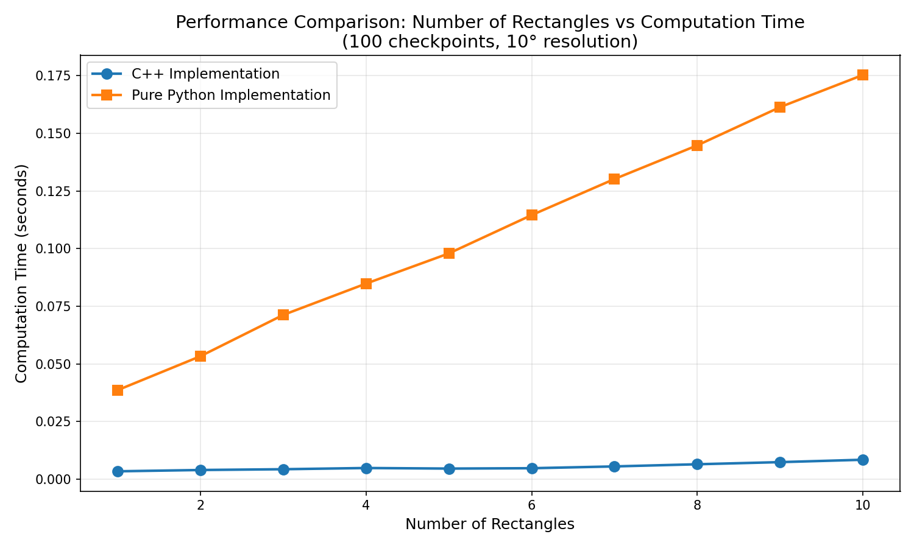
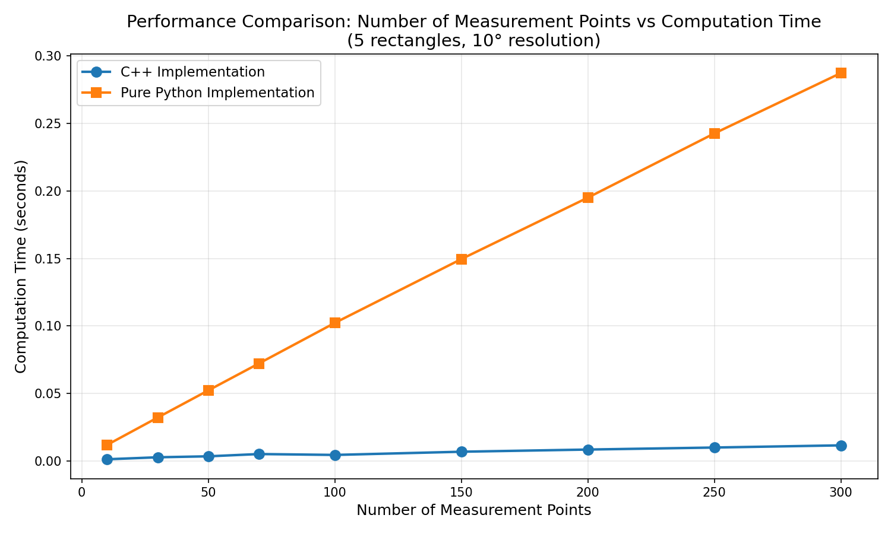

# sky-ratio-calc

天空率計算プロジェクト

このプロジェクトは、C++とPythonを連携させて天空率（Sky Ratio）を計算するライブラリです。建物や障害物を配置したシーンに対して、指定した測定点から見える天空の割合を計算します。

## 必要なもの

- Python 3.9以上
- CMake 3.15以上
- C++コンパイラ (GCC, Clang, MSVCなど)

## ビルド方法

### 開発環境でのインストール

```bash
# submoduleを含めてクローン
git clone --recursive https://github.com/20niship/sky-ratio-calc.git
cd sky-ratio-calc

# 編集可能モードでインストール
pip install -e .
```

既にクローン済みの場合は、submoduleを初期化：

```bash
git submodule update --init --recursive
```

### パッケージのビルド

```bash
pip install .
```

## テスト方法

```bash
python test/test_binding.py
```

## 使用例

### Python

```python
import sky_ratio_calc

# シーンの作成
scene = sky_ratio_calc.SceneRaycaster()

# 建物を追加(ボックス: 位置, サイズ, オイラー角)
scene.add_box([5.0, 0.0, 0.0], [2.0, 2.0, 10.0], [0.0, 0.0, 0.0])
scene.add_box([-5.0, 0.0, 0.0], [2.0, 2.0, 8.0], [0.0, 0.0, 0.0])

# 球体を追加(中心, 半径)
scene.add_sphere([0.0, 8.0, 5.0], 2.0)

# BVHを構築
scene.build()

# 天空率チェッカーの作成
checker = sky_ratio_calc.SkyRatioChecker()
checker.set_scene(scene)
checker.ray_resolution = 5.0  # レイの角度刻み(度)

# 測定点を追加
checker.checkpoints = [
    [0.0, 0.0, 1.5],   # 測定点1
    [3.0, 0.0, 1.5],   # 測定点2
]

# 天空率を計算
sky_ratios = checker.check()

for i, ratio in enumerate(sky_ratios):
    print(f"測定点 {i + 1}: {ratio * 100:.2f}%")
```

詳細なサンプルは `test/sample_python.py` を参照してください。

### C++

```cpp
#include "scene_raycaster.hpp"
#include "sky_ratio_checker.hpp"

int main() {
    // シーンの作成
    SceneRaycaster scene;
    scene.add_box({5.0, 0.0, 0.0}, {2.0, 2.0, 10.0}, {0.0, 0.0, 0.0});
    scene.add_sphere({0.0, 8.0, 5.0}, 2.0);
    scene.build();
    
    // 天空率チェッカーの作成
    SkyRatioChecker checker;
    checker.set_scene(scene);
    checker.ray_resolution = 5.0f;
    checker.checkpoints.push_back({0.0, 0.0, 1.5});
    
    // 天空率を計算
    auto sky_ratios = checker.check();
    
    return 0;
}
```

詳細なサンプルは `src/sample_cpp.cpp` を参照してください。

C++サンプルの実行：
```bash
./build/cp312-cp312-linux_x86_64/sample_cpp
```

## プロジェクト構成

```
.
├── src/
│   ├── scene_raycaster.hpp/cpp   # レイキャスト機能
│   ├── sky_ratio_checker.hpp/cpp # 天空率計算機能
│   ├── hello.cpp                 # Pythonバインディング
│   ├── sample_cpp.cpp            # C++サンプル
│   └── ext/
│       ├── nanobind/             # nanobind (git submodule)
│       └── tinybvh/              # tiny_bvh (git submodule)
├── test/
│   ├── test_binding.py           # バインディングのテスト
│   └── sample_python.py          # Pythonサンプル
├── CMakeLists.txt                # CMakeビルド設定
├── pyproject.toml                # Pythonパッケージ設定
└── README.md                     # このファイル
```

## 実装の詳細

### SceneRaycaster

3Dシーンを構築し、レイキャスト（光線追跡）を実行するクラスです。

- `add_box(pos, size, euler)`: ボックスを追加
- `add_sphere(center, radius)`: 球体を追加
- `add_mesh(vertices)`: メッシュを追加
- `build()`: BVH（Bounding Volume Hierarchy）を構築
- `raycast(origins, directions)`: レイキャストを実行

内部では tiny_bvh ライブラリを使用して高速なレイキャストを実現しています。

### SkyRatioChecker

指定した測定点から天空率を計算するクラスです。

- `checkpoints`: 測定点のリスト (Vec3の配列)
- `ray_resolution`: レイの角度刻み（度）。デフォルトは1.0度
- `set_scene(scene)`: シーンを設定
- `check()`: 各測定点の天空率を計算

天空率は、測定点から半球状にレイを飛ばし、障害物に当たらないレイの割合として計算されます。

## パフォーマンス比較

このプロジェクトでは、C++実装（Pythonバインディング経由）と純粋なPython実装の両方を提供しています。以下は、両実装の性能比較結果です。

### ベンチマーク設定

長方形が1〜10個集まった形状について、複数の測定点（10〜300点）をもとに天空率を計算し、実行時間を比較しました。レイの角度刻みは10度に設定しています。

### 比較1: 長方形の数と計算時間

100個の測定点を使用し、長方形の数を1〜10個まで変化させた場合の計算時間の比較：



### 比較2: 測定点の数と計算時間

5個の長方形を使用し、測定点の数を10〜300個まで変化させた場合の計算時間の比較：



### 結果まとめ

- **C++実装**: 高速な実行速度を実現。tiny_bvhライブラリを使用した最適化されたレイキャストにより、大規模なシーンでも高速に処理可能
- **Python実装**: 約**18〜20倍遅い**ですが、依存関係が少なく、シンプルな実装で理解しやすい
- **長方形の数**: 両実装ともほぼ線形に計算時間が増加
- **測定点の数**: 両実装とも測定点の数に比例して計算時間が増加

実用的な用途では、C++実装（Pythonバインディング経由）の使用を推奨します。Python実装は学習や小規模なテスト用途に適しています。

## License

See LICENSE file.

